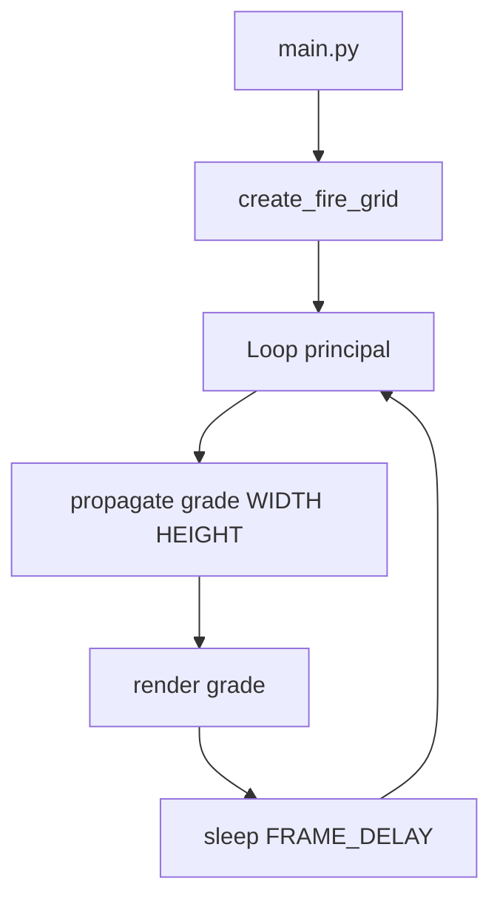

# 🧠 DoomFire-Terminal - Efeito de Fogo no Terminal Estilo DOOM

## Inspirado no famoso DOOM Fire Effect do Fabien Sanglard

> Projeto acadêmico voltado para implementação de efeitos visuais procedurais em terminal.

---

## 📋 Sumário Executivo

- **O que faz**: Renderiza uma simulação de fogo realista usando caracteres `█` coloridos via escape codes ANSI.
- **Como funciona**: Algoritmo de propagação celular — cada célula herda a intensidade da célula abaixo com decremento aleatório e deslocamento horizontal (vento).
- **Tecnologias**: Python, colorama / ANSI escape codes.

---

## 🚨 Aviso Legal
Software puramente visual e educacional.

---

## 🧭 Visão Geral
- **Propagação Celular**: Algoritmo de propagação bottom-up com vento aleatório.
- **Paleta ANSI**: 30 níveis de intensidade mapeados de preto a branco passando por vermelho e amarelo.
- **Cross-Platform**: Funciona em qualquer terminal com suporte a ANSI.

---

## 🧩 Arquitetura
- `fire_engine.py` — Criação da grade, propagação e renderização.
- `main.py` — Loop principal com controle de FPS e limpeza do terminal.

---

## 🔄 Fluxo de Trabalho



---

## 📂 Estrutura de Diretórios

```
/DoomFire-Terminal
├── /src
│   ├── main.py
│   └── fire_engine.py
└── README.md
```

---

## 💻 Código de Exemplo

```python
# fire_engine.py - Propagação com vento
wind = random.randint(-1, 1)
nx = max(0, min(w - 1, x + wind))
grid[y][x] = max(0, grid[y+1][nx] - random.randint(0, 2))
```

---

## 🌐 APIs e Ferramentas

| Categoria | Ferramenta | Uso |
|---|---|---|
| Terminal | ANSI escape codes | Cores e posicionamento |
| Aleatório | random | Efeito de vento e decaimento |

---

## 🧾 Conclusão
- **Benefícios**: Demonstra como efeitos visuais ricos são possíveis com apenas texto.
- **Aplicações**: Screensaver de terminal, demos, intro screens.

---

# created by - Panda12332145


_"Conhecimento é poder, e a verdadeira liberdade vem do domínio sobre a informação."_
