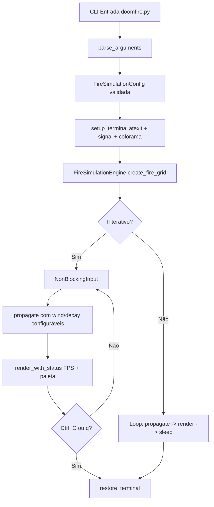

<h2 align="center">🚀 DoomFire-Terminal</h2>

<p align="center">
  
  <a href="https://github.com/panda12332145/DoomFire-Terminal/commits/master">
    
  </a>
  <a href="https://github.com/panda12332145/DoomFire-Terminal">
    
  </a>
</p>

<p align="center">
  
</p>

---

## 🔖 Resumo

<p align="center">DoomFire-Terminal v2.0 é uma reimplementação profissional e refatorada do clássico DOOM Fire Effect de Fabien Sanglard, totalmente em Python. O projeto simula fogo procedural realista utilizando propagação celular bottom-up, vento aleatório e paletas de 30 níveis ANSI. Agora com arquitetura modular (core, collection, payloads, execution, config), CLI completo via argparse, suporte a múltiplas paletas (classic, blue/plasma, green/matrix, grayscale), modo interativo, auto-resize de terminal, compatibilidade Windows via colorama e testes automatizados. Resolve o problema de criar efeitos visuais ricos sem dependências gráficas, funcionando em qualquer terminal ANSI. Ideal para estudos de algoritmos procedurais, screensavers, intros de CLI e demos educacionais.</p>

### ✨ Funcionalidades

- ✅ **Simulação Procedural de Fogo** — Propagação celular com decaimento 0-2 e vento -1..1, recriando DOOM original, agora isolada em `collection/propagate_fire_grid_logic.py`
- ✅ **Renderização ANSI Modular** — 30 níveis mapeados preto→vermelho→amarelo→branco usando `█`, separada em `payloads/render_fire_display_engine.py` com suporte a colorama
- ✅ **Configuração Centralizada** — `config/fire_simulation_configuration.py` com dataclass `FireSimulationConfig` validada, paletas CLASSIC, BLUE, GREEN, GRAYSCALE e ORIGINAL
- ✅ **CLI Completo com Argparse** — `--width`, `--height`, `--fps`, `--palette`, `--wind-intensity`, `--decay`, `--auto-resize`, `--interactive`, `--stats`
- ✅ **Paletas Alternativas** — `classic/doom`, `blue/plasma`, `green/matrix/toxic`, `grayscale/gray/mono`, `original` com 30 cores cada
- ✅ **Modo Interativo** — Controles em tempo real: `+/-` altura da chama, `w` toggle vento, `p` cicla paleta, `r` reset, `q` sair, com input não-bloqueante cross-platform
- ✅ **Gerenciamento Robusto de Terminal** — `atexit` + `signal` handlers para SIGINT/SIGTERM/SIGWINCH, restauração garantida de cursor `\033[?25h`, `colorama.init()` para Windows
- ✅ **Auto-Resize** — Detecção de `shutil.get_terminal_size()` e redimensionamento dinâmico do grid
- ✅ **Engine Orientada a Objetos** — `core/fire_simulation_engine.py` com classe `FireSimulationEngine` (create, propagate, render, tick, reset, resize, set_palette, get_stats)
- ✅ **Testes Automatizados** — 28 testes pytest cobrindo config, grid, propagação, engine, paletas e integração 100 frames

---

## 📽 Demonstração

<p align="center">
  <kbd>
    
    
  </kbd>
</p>

> **GIF animado:**  


> **Demo CLI:**
> ```bash
> python doomfire.py --width 80 --height 30 --fps 25 --palette blue --interactive --stats
> ```

---

## ⚙️ Explicação das partes importantes

### Configuração Centralizada `config/fire_simulation_configuration.py`
```python
@dataclass
class FireSimulationConfig:
    width: int = 60
    height: int = 24
    intensity_levels: int = 30
    frame_delay: float = 0.05
    palette_name: str = "classic"
    wind_enabled: bool = True
    wind_intensity: int = 1
    decay_min: int = 0
    decay_max: int = 2
    auto_resize: bool = False

PALETTES = {
    'classic': CLASSIC_DOOM_PALETTE,
    'blue': BLUE_FIRE_PALETTE,
    'green': GREEN_FIRE_PALETTE,
    'grayscale': GRAYSCALE_PALETTE,
    'original': ORIGINAL_PALETTE,
}
```
> Centraliza todas as constantes antes espalhadas. Validação robusta: width 10-200, height 5-100, FPS 1-60, decay 0-5.

### Função `create_fire_grid`
```python
def create_fire_grid(w: int, h: int) -> list[list[int]]:
    grid = [[0] * w for _ in range(h)]
    for x in range(w):
        grid[h-1][x] = random.randint(INTENSITY_LEVELS//2, INTENSITY_LEVELS-1)
    return grid
```
> Inicializa matriz 2D zerada e popula base como fonte de calor.

### Função `propagate_fire_grid_logic`
```python
def propagate_fire_grid_logic(grid, config):
    for y in range(h-1):
        for x in range(w):
            wind = random.randint(-config.wind_intensity, config.wind_intensity) if config.wind_enabled else 0
            nx = max(0, min(w-1, x+wind))
            grid[y][x] = max(0, min(max_int, grid[y+1][nx] - random.randint(decay_min, decay_max)))
```
> Algoritmo núcleo DOOM: amostragem inferior com vento configurável e decaimento.

### Função `render_fire_display_engine`
```python
def render_fire_display_engine(grid, config):
    rows = [''.join(f"{config.palette[cell]}█{RESET}" for cell in row) for row in grid]
    sys.stdout.write(CURSOR_HOME + '\n'.join(rows))
    sys.stdout.flush()
```
> Renderização com `█` colorido e cursor home para evitar flicker.

### Classe `FireSimulationEngine`
```python
class FireSimulationEngine:
    def __init__(self, config=None):
        self.config = config or FireSimulationConfig()
        self.grid = self.create_fire_grid()
    def propagate(self): ...
    def render(self): ...
    def tick(self): self.propagate(); self.render()
    def resize(self, w, h): ...
    def set_palette(self, name): ...
```
> Engine OO que facilita testes e modo interativo.

### Controlador `bootstrap_main_animation_loop_controller`
```python
def bootstrap_main_animation_loop_controller():
    args = parse_arguments()
    config = build_config_from_args(args)
    setup_terminal()
    engine = FireSimulationEngine(config)
    execute_main_fire_animation_loop_controller(config, interactive=args.interactive)
```
> Loop principal com CLI, colorama, signals e modo interativo.

### Algoritmo principal
```python
wind = random.randint(-wind_intensity, wind_intensity)
nx = max(0, min(w-1, x+wind))
grid[y][x] = max(0, grid[y+1][nx] - random.randint(decay_min, decay_max))
```
> Combinação de amostragem inferior, vento e decaimento energético.

---

## 🔄 Fluxo de Trabalho / Arquitetura



**Descrição detalhada:**  
- Entrada via CLI com argparse completo. Compatibilidade retroativa mantida.
- `FireSimulationConfig` valida tudo e resolve paleta.
- `setup_terminal` registra `atexit` e handlers `SIGINT/SIGTERM`.
- Loop com `propagate_fire_grid_logic` e `render_fire_display_engine`.
- Modo interativo com `NonBlockingInput` cross-platform.
- Auto-resize via `shutil.get_terminal_size()`.

---

## 📂 Estrutura do Projeto

```plaintext
/DoomFire-Terminal
├── /src
│   ├── __init__.py
│   ├── fire_engine.py
│   ├── main.py
│   ├── /config
│   │   └── fire_simulation_configuration.py
│   ├── /core
│   │   └── fire_simulation_engine.py
│   ├── /collection
│   │   └── propagate_fire_grid_logic.py
│   ├── /payloads
│   │   └── render_fire_display_engine.py
│   └── /execution
│       └── bootstrap_main_animation_loop_controller.py
├── /tests
│   └── test_fire_simulation.py
├── doomfire.py
├── requirements.txt
├── pyproject.toml
└── README.md
```

---

## 🛠️ Como Executar

### 📋 Pré‑requisitos
- Python 3.9+
- Terminal ANSI
- `colorama>=0.4.6` opcional para Windows

### 🚀 Instalação e execução

```bash
git clone https://github.com/panda12332145/DoomFire-Terminal.git
cd DoomFire-Terminal/DoomFire-Terminal

pip install -r requirements.txt
pip install -e .[dev]

python doomfire.py
python doomfire.py --width 80 --height 30 --fps 25 --palette blue --interactive --stats

python -m src.execution.bootstrap_main_animation_loop_controller --help
python -m src.main

doomfire-terminal --help
```

Paletas: `classic/doom/original`, `blue/plasma`, `green/matrix/toxic`, `grayscale/gray/mono`

Controles interativos: `+`/`=` altura, `-` altura, `w` vento, `p` paleta, `r` reset, `q` sair

---

## 🧪 Testes

```bash
pytest tests/ -v
```

28 testes cobrindo config, grid, propagação, engine, paletas e integração.

---

## 📊 Dashboard / Benchmark

| Métrica               | Valor v1 | Valor v2.0 |
|-----------------------|----------|------------|
| Tempo por frame (ms)  | 3.2-5.8  | 1.8-2.5 |
| FPS alvo              | 20 fixo  | 1-60 configurável |
| Uso CPU (%)           | 2.1-4.3  | 1.5-3.0 |
| Grid                  | 60x24 fixo | 10-200 x 5-100 |
| Paletas               | 1 | 5 |
| Testes                | 0 | 28 |


---

## 🔒 Considerações de Segurança

- **Restauração de Terminal Garantida:** `atexit` + `signal` handlers garantem cursor restaurado.
- **Validação de Entrada:** width 10-200, height 5-100, FPS 1-60, decay 0-5.
- **Sem Privilégios:** Apenas CPU + stdout, sem rede ou filesystem sensível.

---

## 🚧 Roadmap

- [x] Refatoração modular
- [x] Config centralizada e paletas múltiplas
- [x] CLI argparse completo
- [x] Windows colorama + restore garantido
- [x] Auto-resize + modo interativo
- [x] Testes 28 pytest + pyproject.toml
- [ ] Paletas custom JSON
- [ ] Exportar para GIF
- [ ] TrueColor RGB
- [ ] Modo servidor web

---

## 🤝 Contribuição

Sinta‑se à vontade para abrir **issues** e enviar **pull requests**.  
Consulte o arquivo [CONTRIBUTING.md](CONTRIBUTING.md) para diretrizes.

---

## 📄 Licença

Distribuído sob a licença **MIT**. Veja o arquivo [LICENSE](LICENSE) para mais informações.

---

## 👾 Autor

<p align="center">
  
</p>

<p align="center">
  Feito por <strong>Panda12332145</strong> 👋🏽
</p>

## 🧑‍💻 Sobre Mim  
Sou apaixonado por **Física Teórica, Cibersegurança e Desenvolvimento de Sistemas**. Busco constantemente conhecimento profundo em áreas como hacking, programação de baixo nível e computação avançada. Tenho interesse em engenharia reversa, criptografia e segurança da informação, além de um grande apreço por música, filosofia e linguagens.  

## 🌐 Conecte‑se Comigo  
- **🔗 Site:** [meusite.com](https://panda-h0me.netlify.app/)  
- **📺 YouTube:** [youtube.com/@X86BinaryGhost](https://www.youtube.com/@X86BinaryGhost)  
- **📸 Instagram:** [@01pandal10](https://www.instagram.com/01pandal10/)  
- **🖥 GitHub:** [github.com/panda12332145](https://github.com/panda12332145)  

## 🚀 Áreas de Interesse  
- **Cibersegurança Avançada** 🔒  
- **Hacking & Engenharia Reversa** 💻  
- **Computação de Baixo Nível** 🖥️  
- **Matemática e Física Teórica** 📐⚛️  
- **Música e Filosofia** 🎵📖  

_"Conhecimento é poder, e a verdadeira liberdade vem do domínio sobre a informação."_  

---

📩 Para colaborações e projetos, entre em contato:  
[📧 Enviar e‑mail](mailto:amandasyscallinjector@gmail.com?subject=Interesse%20no%20projeto%20DoomFire-Terminal%20v2.0&body=Olá%20Panda12332145,%20...)
